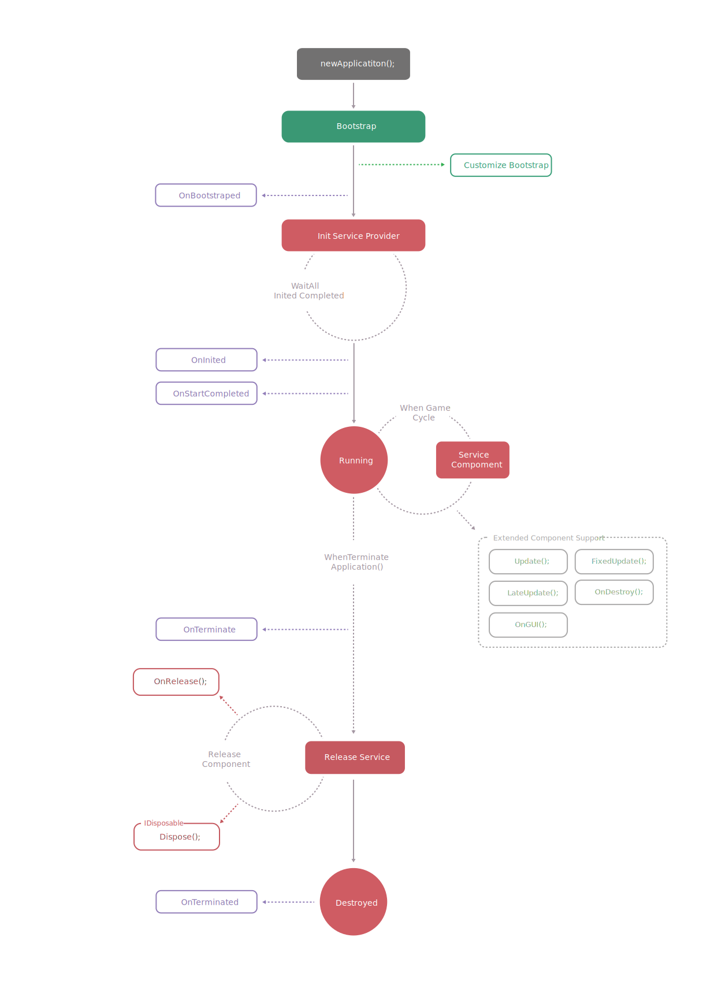

# Application

`Application` is the core of the CatLib program and is the entry class for the program.

The application loads the service provider and other necessary resources through the boot. In general, an application is only recommended to new one and can only be started in the main thread.

## Startup process

`Bootstrap` -> `Init`

- **Bootstrap**: Often used to boot the service provider, initial configuration, or some other resource.
- **Init**: Call `Init` method of all service providers and complete the framework startup. initialization.

## The life cycle

<div style="padding-left:10%"></div>

## Create new instance.

- Create a frame instance with `Application.New`
```csharp
var app = Application.New();
```

- Create a frame instance by manually instantiating
```csharp
var app = new Application();
```

## Bootstrap

The bootloader must implement the `IBootstrap` insterface. The bootstrap can be used to guide the registration service provider, or other programs that need to be loaded before the framework is started.

```csharp
public class BootstrapFoo : IBootstrap
{
    public void Bootstrap()
    {
        Console.WriteLine("booting.");
    }
}
```

```csharp
app.Bootstrap(new BootstrapFoo()); // booting.
```

## Register

The service provider can be registered to the application via the `Register` method. The service provider must implement the `IServiceProvider` interface.

``` csharp
public class ProviderFoo : IServiceProvider
{
    public void Init(){ }
    public void Register()
    {
        Console.WriteLine("register.");
    }
}
```

```csharp
app.Register(new ProviderFoo()); // register.
```

## Init

Calling the `Init` method will initialize the framework. And invoke the `Init` method in the service provider in order of registration.

``` csharp
public class ProviderFoo : IServiceProvider
{
    public void Init()
    { 
        Console.WriteLine("init foo");
    }
    public void Register()
    {
        Console.WriteLine("register foo");
    }
}
```

``` csharp
public class ProviderBar : IServiceProvider
{
    public void Init()
    { 
        Console.WriteLine("init bar");
    }
    public void Register()
    {
        Console.WriteLine("register bar");
    }
}
```

```csharp
app.Register(new ProviderBar()); // register bar
app.Register(new ProviderFoo()); // register foo

app.Init();                      // init bar
                                 // init foo
```

## Terminate

When the program exits, you need to call the `Terminate` method to terminate the framework. Services registered in this framework will be released in an orderly manner. For the release order, please refer to [Lifecycle] (#Lifecycle).

```csharp
app.Terminate();
```

## Events

The following events are embedded in the application and are automatically triggered when the condition is met. The event names are placed in `ApplicationEvents`.

For the simple event system, please refer to: [Event System] (../components/event.html) for detailed documentation.

```csharp
var dispatcher = app.Make<IEventDispatcher>();
dispatcher.AddListener(ApplicationEvents.OnStartCompleted, (obj) =>
{
    var eventArgs = (StartCompletedEventArgs)obj;
});
```

| Event name                       |  Payload                    | 
|:--------------------------------:|:---------------------------:|
| `OnBeforeBoot`                   | `BeforeBootEventArgs`       | 
| `OnBooting`                      | `BootingEventArgs`          |
| `OnAfterBoot`                    | `AfterBootEventArgs`        |
| `OnRegisterProvider`             | `RegisterProviderEventArgs` | 
| `OnBeforeInit`                   | `BeforeInitEventArgs`       |
| `OnInitProvider`                 | `InitProviderEventArgs`     |
| `OnAfterInit`                    | `AfterInitEventArgs`        |
| `OnStartCompleted`               | `StartCompletedEventArgs`   |
| `OnBeforeTerminate`              | `BeforeTerminateEventArgs`  |
| `OnAfterTerminate`               | `AfterTerminateEventArgs`   |
  
# OnNewApplication

With `App.OnNewApplication` you can capture Application creation events, which are useful for programs that have been executed before the Application was created or for programs that need to listen for application changes.

``` csharp
App.OnNewApplication += (app) =>
{
};
```

## DebugLevel

You can set the debug level of the framework with `DebugLevel`, and all components can recognize this debug level to make the corresponding processing. By default, the debug level of the framework is **Production**.

```csharp
app.DebugLevel = DebugLevels.Production;
```

## Get runtime unique id

During the application lifecycle, you can use the `GetRuntimeId` method to get a unique Id at runtime, which is multithread safe.

```csharp
int rid = app.GetRuntimeId();
```

## IsRegistered

You can determine if the service provider has been registered to the application via `IsRegistered`.

```csharp
app.IsRegistered(provider);
```

## IsMainThread

You can use `IsMainThread` to determine if it is in the main thread (The thread that created the application will be considered the main thread).

``` csharp
app.IsMainThread;
```

## Version

The version of the framework can be obtained via `Version`, see more [semantic version] (https://semver.org/)

```csharp
app.Version;
```