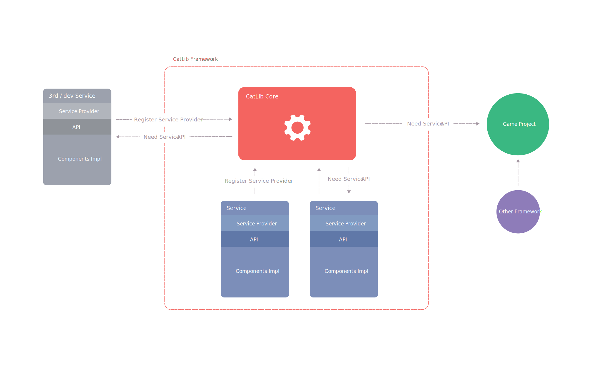

# Service provider

The service provider is the bridge between the `Component` and the `CatLib`. It is also the center of CatLib startup, and all services are defined by service providers.

## Architecture diagram



## Create service provider

Service providers are used to describe how a service provides services to users. These relationships often include whether the service is a singleton, how the service is initialized after it is built, and so on.

##### Why use a service provider?

- The service provider class can clearly clarify from the directory structure which class is the service registration class. If the service provider class is not used, the developer cannot quickly identify which class provides the service for the framework.
- The service provider is similar to glue, sticking to the service and framework, and dependency injection is done automatically through the constructor, so that even the framework can be developed during the development of the service.

> A service provider is just a management tool. Use a service provider to guide or manage your components so that components can be combined and collaborated with each other. Please give full play to your imagination!

##### Writing a service provider and using an interface can be too much trouble?

Some people may criticize. I understand that a simple function has to implement such a large circle of functions, which means that the code is too long. You must define the interface and implement it, and then register with the service provider. How much code to knock on!

For small and simple programs, there is nothing wrong with the above statement. In simple functions, the interface is usually unnecessary. It is also possible to couple the code to a place that you think will not change, such as a one-time task, or Some prototypes or demo projects, after all, this flexibility will bring more code.
Sometimes it does not change. And small programs don't require architects, and architects serve large projects.

In large projects, the interface is very helpful. Compared with the improved code flexibility and testability, the time it takes to knock a few more keyboards is negligible.。

If you don't want to follow the interface principle when writing a small program, go back to the original mode, don't think there is any problem, then there is nothing wrong with it. But you have to make an assessment of the drawbacks it brings.

#### With IServiceProvider

Your service provider class must implement the `IServiceProvider` interface, which contains `Register` and `Init` methods.

In the `Register` method, the only thing you need to do is to **bind the service implementation** to the service container. Don't try to perform any other functions in it, otherwise a `CodeStandardException` exception will be thrown.

``` csharp
public class ProviderFoo : IServiceProvider
{
    public void Init(){ }
    public void Register()
    {
        App.Singleton<IFoo, Foo>();
    }
}
```

The `Init` method will be executed after the execution of the `Register` method of all service providers, which means that we can access the services provided by other service providers in `Init` method.

``` csharp
public class ProviderBar : IServiceProvider
{
    public void Init()
    { 
        var foo = App.Make<IFoo>();
    }
    public void Register(){ }
}
```

#### With ServiceProvider

You can also simplify the way service providers are built by inheriting `ServiceProvider`:

``` csharp
public class ProviderFoo : ServiceProvider
{
    public override void Init()
    { 
    }
}
```

## Register provider

If the user of the framework wants to use a service, then the service must be registered first:

``` csharp
App.Register(new ProviderFoo());
```

> Registering a service provider does not mean that the service will be instantiated immediately. Usually, many are de-instantiated and instantiated only when they are actually used.
